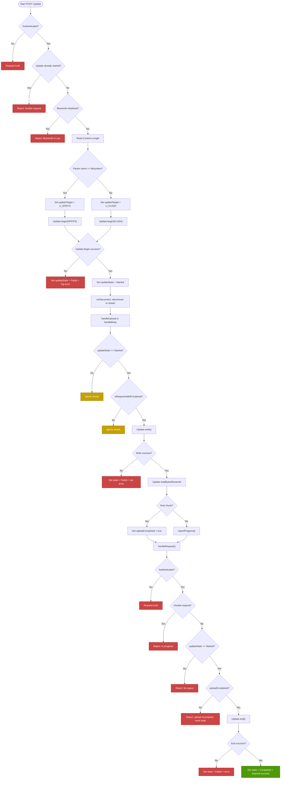

# OTA Update Documentation – RGBW Controller

This document provides a standalone technical reference for the OTA (Over-The-Air) update process implemented in the ESP32-based RGBW Controller firmware.

---

## Overview

The OTA update process allows firmware and filesystem images to be uploaded to the device over HTTP. The logic is encapsulated in the `OtaHandler` class and executed through a custom `AsyncWebHandler`, providing a secure and robust flow.

Supported updates:

* 🔧 Firmware (U\_FLASH)
* 📁 Filesystem (U\_SPIFFS for LittleFS partitions)

---

## Authentication

All OTA requests are protected using Basic Authentication.
If the request does not contain valid credentials, it is rejected with:

```
HTTP/1.1 401 Unauthorized
```

The `AsyncAuthenticationMiddleware` handles access control.

---

## Endpoint

### `POST /update`

| Parameter | Type   | Required  | Description                          |
| --------- | ------ | --------- | ------------------------------------ |
| `file`    | file   | ✅ Yes    | Binary file (firmware or filesystem) |
| `name`    | string | ❌ No     | `filesystem` (default is firmware)   |

Example (firmware):

```bash
curl -u user:pass -F "file=@firmware.bin" http://<device-ip>/update
```

Example (filesystem):

```bash
curl -u user:pass -F "name=filesystem" -F "file=@littlefs.bin" http://<device-ip>/update
```

---

## Auto-Restart

Upon a successful update (`Update.end(true)`), the device calls `ESP.restart()` to apply the new firmware or filesystem.
To ensure the response reaches the client first, the restart is deferred using:

```cpp
request->onDisconnect([]() {
    ESP.restart();
});
```

---

## OTA Logic Flow



---

## Error Scenarios

| Case                          | Response Code | Notes                                |
| ----------------------------- | ------------- | ------------------------------------ |
| No authentication             | 401           | Requires Basic Auth                  |
| OTA already in progress       | 400           | Double request protection            |
| Bluetooth active              | 500           | BLE must be disabled for OTA         |
| Update.begin() failed         | 500           | Flash not available or corrupt       |
| Upload incomplete             | 500           | Did not receive full file            |
| Update.write() failed mid-way | 500           | Flash write error, possibly hardware |

---

## Progress Reporting

The handler supports a callback to monitor update progress:

```cpp
void setOnProgressCallback(std::function<void(UpdateState, uint8_t)> callback);
```

The callback receives percentage (0–100) during upload based on `Content-Length`.

---

## Error Message Truncation

OTA errors returned to the client (via HTTP 500) are truncated to a maximum of 64 bytes to ensure safe delivery and memory efficiency.

---

## Conclusion

The OTA handler offers a safe and extensible mechanism to update the ESP32 remotely, with proper authentication, state control, and progress monitoring.
It integrates tightly with Bluetooth status and provides detailed error handling to cover edge cases.

Internally, the update state is tracked using `std::atomic` to ensure thread-safe transitions and consistent reads across callbacks.
